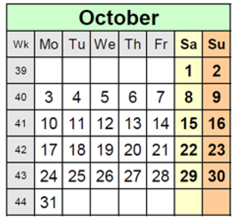

# Calendar coding
Coding exercise to create a command line tool to generate calendars in HTML

## The challenge
Write a HTML calendar generator in a programming language of your choice  
Requirements:
  1) It should be a command line tool.
  2) Output of the generator shall be a static HTML page.
  3) The year should be taken as a command line option.
  4) Name of the generated file shall be taken as a command line option.
  5) We assume usage of the Gregorian calendar  
    a. https://en.wikipedia.org/wiki/Gregorian_calendar  
    b. Earliest supported date: October 1582  
  6) Calendar shall be generated for: Year – 1, then Year and then Year + 1  
    a. i.e. if a year is 2016 then generation should happen for 2015, 2016 and 2017
  7) Calendar shall have a following format for a month:  
    a. 
  8) Week days are mandatory.
  9) Week numbers are optional.
  10) The overall format of the calendar is up to you.
  11) Usage of time / calendar-related libraries is forbidden.
  12) Generate example calendars for the following dates:
    a. 1800
    b. 1900
    c. 2000
    d. 2017
  13) Send the generated HTML for the example calendars and the source code to us.

## Build 
```bash

```

## Run
```bash

```
